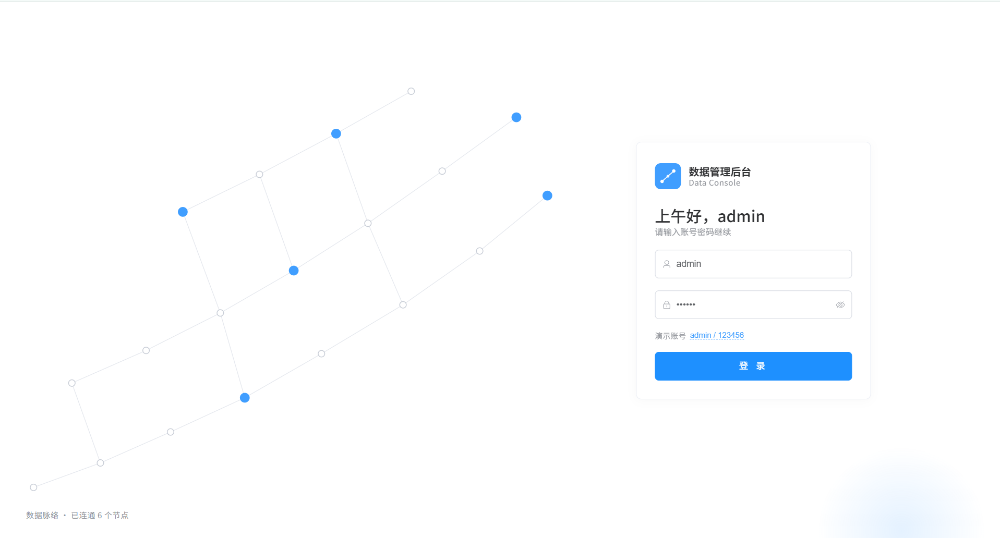
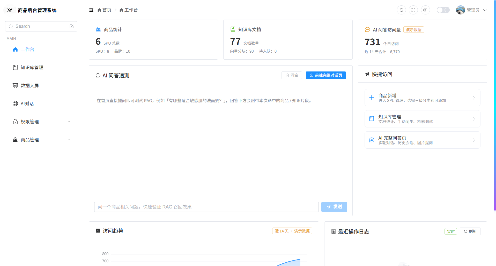
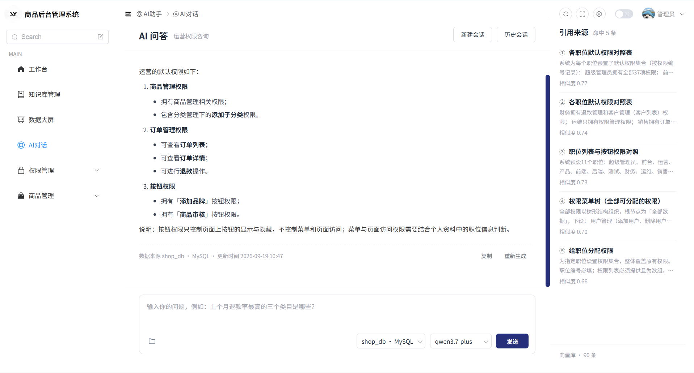
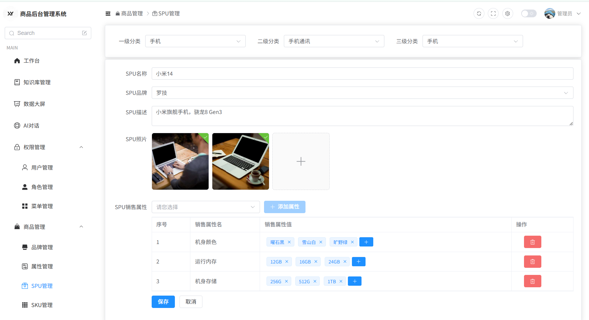

# 商品后台管理系统（Vue3 + Node.js + AI 问答）

# 项目介绍

- 基于 Vue3 + TypeScript + Node.js + MySQL + LanceDB  实现的商品后台管理系统
- 提供商品管理、用户管理、角色管理、菜单管理、上下架审核、操作日志、数据大屏、AI 问答等功能
- 涵盖三阶段的学习过程：
  - 第一阶段：练习前端开发与 Vue3 框架
  - 第二阶段：练习后端开发与接口设计（业务后端从 vite-plugin-mock 迁移为独立 Express 服务）
  - 第三阶段：练习 AI 问答功能搭建（RAG 知识库、工具调用、流式对话）

# 效果截图






# 功能清单

- 用户登录：token 签发（携带 userId）、refreshToken 下发、登录后按角色返回权限码
- 数据大屏：ECharts 图表展示（趋势图、地图、占比图等）
- 权限管理（RBAC：后端前置鉴权 + 前端按钮级显隐 `v-hasBtn`）
  - 用户管理：增删改查账户；分配职位；编辑自己 → 自动登出重新登录；批量操作
  - 角色管理：增删改查职位；分配权限（权限树勾选）
  - 菜单管理：增删改查权限
- 商品增删改查、上下架
  - 品牌管理：增删改查品牌；表单校验；图片上传；回收站（软删除，30 天内可恢复）
  - 属性管理：商品三级分类联动；增删改查属性；空值校验、重复校验；回收站
  - SPU 管理：
    - spuForm：SPU 名称、品牌选择、描述；多图上传；销售属性选择与属性值录入；属性值空值 / 重复校验；编辑时有 `attrCache` 缓存 + `requestVersion` 防抖（防止快速切换导致旧请求覆盖新状态）
    - skuForm：SKU 名称、价格、重量、描述；平台属性多选
  - 上下架审核：提交审核单 / 审核分页列表 / 通过 / 驳回（驳回必须填写理由）/ 批量通过与驳回；审核与商品写权限分离（独立权限码）
- 操作日志：在路由统一出口自动记录高敏感操作（删除账号、删除角色、删除 SPU/SKU/品牌/属性、审核通过 / 驳回等），提供日志查询接口，操作留痕可追溯
- AI 问答（本地知识库 RAG）：
  - 会话管理：新建对话、历史会话列表、AI 自动生成会话标题
  - 模型切换：对话模型 / 文生图模型切换（服务端白名单校验，防越权调用）；支持消息附带图片
  - 流式传输：SSE 逐帧下发，客户端断开时主动中断上游生成
  - 记忆系统：对话记忆（超过 20 条时自动裁剪，只保留最新 10 条）、用户特点记忆（画像注入 system 提示词，1.5s 内未就绪不阻塞首字响应）
  - Markdown 渲染
  - RAG 本地知识库：检索前 Query 改写 → Embedding → LanceDB 向量检索 → 相似度阈值过滤 → 按相关度降序排序并展示来源（可溯源）；检索异常自动降级为无检索模式；知识库支持业务侧增量增删改（带令牌鉴权）

# 技术栈

- 前端：Vue 3 + TypeScript + Vite + Element Plus 
- 业务后端：Node.js + Express + CORS
- AI 后端：Node.js + MySQL + LanceDB 向量库 + langchain
- 工程化：Vitest 单元测试与覆盖率、ESLint + Prettier + Stylelint + husky、配置中心启动期校验（缺配置直接拒绝启动）、健康检查接口

# 项目亮点

1. 独立完成项目骨架搭建，包括 Vue3 界面、后端接口与数据结构设计；基于硅谷后台管理项目重新拆解架构，并补充深层需求功能
2. 接口层重构：将 60 条 mock 路由从 vite-plugin-mock 迁移到独立 Express 后端，通过统一 adapter 注册——鉴权前置（未通过直接 401/403）、未匹配路由 404 JSON 兜底、错误统一 JSON 返回，业务模块零鉴权代码
3. RAG 检索链路：Query 改写 → 向量化 → LanceDB 检索 → 阈值过滤 → 相关度排序 + 来源溯源；全链路内置降级兜底（改写失败用原句、Embedding/向量库异常降级为无检索模式），保证问答主流程不中断
4. 知识库增量同步闭环：业务侧写库成功后 fire-and-forget 回调 `/kb/upsert|delete`，AI 后端以串行队列增量刷新向量（避免并发写脏数据）；队列上限 + 503 背压；`KB_SYNC_TOKEN` 采用常量时间比较防时序攻击
5. AI 会话工程化：SSE 流式 + 断连中断上游节省费用、失败回滚用户消息（脏数据不落库）、历史消息裁剪、自动生成标题、用户画像异步注入不阻塞首字、会话归属校验防 IDOR 越权
6. 健康检查与可观测性：`/health` 依赖探测（MySQL / LanceDB）采用独立探测连接池 + 结果缓存 + 并发合并 + 失败冷却，避免健康检查拖垮业务；配置中心启动期校验，缺配置给出可执行的修复提示
7. 业务增强功能：硅谷甄选项目拆解重构，增加深层需求功能，例如：商品软删除与回收站恢复、上下架审核流、高敏感操作日志留痕，服务多人协作场景

# 项目结构

```
manageCode/
├── admin-front/                # 前端项目（Vue3 + Vite）
│   ├── src/
│   │   ├── api/                # 接口层，按模块划分（user / role / menu / product / spu / sku / audit / ai-chat / knowledge / log / dashboard / category）
│   │   ├── assets/             # 静态资源
│   │   ├── components/         # 通用组件
│   │   ├── directives/         # 自定义指令（v-hasBtn 按钮级权限）
│   │   ├── router/             # 路由
│   │   ├── stores/             # Pinia 状态管理
│   │   ├── styles/             # 全局样式
│   │   ├── utils/              # 工具（permission.ts 权限码定义等）
│   │   └── views/              # 页面：dashboard（数据大屏）/ goods（brand·attr·spu·sku·review）/ permission（user·role·menu）/ ai-chat / knowledge / data-screen
│   └── .env.development        # VITE_API_BASE_URL（业务后端）/ VITE_AI_API_BASE_URL（AI 后端）
│
├── admin-mock-backend/         # 业务后端（Express + 内存态数据）
│   └── src/
│       ├── index.ts            # 入口：CORS + 路由注册 + 404 兜底
│       ├── adapter.ts          # 统一路由出口：鉴权前置 / 知识库同步 / 操作日志
│       ├── mock/               # audit / brand / attribute / log / role / sku / spu / user 共 8 个模块
│       ├── permission/         # codes（权限码）· matrix（角色矩阵）· guard（前置鉴权）· session（token 签发与解析）
│       ├── operation/          # 敏感操作留痕：rules（规则）+ record（记录）
│       └── kb/sync.ts          # 业务写入成功后回调 AI 后端 /kb/* 增量同步
│
├── admin-ai-backend/           # AI 后端（Express + MySQL + LanceDB + MCP）
│   └── src/
│       ├── bootstrap.js        # 启动引导：配置缺失时输出友好错误而非裸堆栈
│       ├── index.js            # HTTP 入口：/chat(SSE) /new /all /title /singleChat /userFeature /changeImg
│       ├── env.js              # 配置中心：读取 src/.env 并启动期校验
│       ├── mysql.js            # 连接池 + initTables（chat_session / chat_message 自动建表）
│       ├── rag/                # RAG 管线：rewriter（改写）· chunker（切块）· loader · indexer（入库）· vectorStore（LanceDB）· retriever（检索）· prompt · manifest
│       ├── MCP/                # MCP 客户端 / 服务端封装（本地 + 远程工具接入）
│       ├── routes/             # health.js（/health 健康检查）· kb.js（/kb/* 知识库增量接口）
│       ├── model/              # 文生图模型调用冒烟脚本
│       ├── utils/              # 工具清单（本地工具 / 卡片工具）、用户画像、消息摘要
│       └── .env.example        # 配置模板（复制为同目录 src/.env）
│
├── image/README/               # README 截图
└── package.json                # 根脚本：concurrently 一键并发启动三个服务
```

# 运行步骤

## 前置要求

- Node.js ≥ 22.12.0（admin-ai-backend 的 engines 限制，版本过低启动会直接报错）
- MySQL 5.7+ / 8.x，并且**先手动创建好数据库**（默认库名 `manage_core`）：服务只自动建表（initTables），不会自动建库
- 一个 OpenAI 兼容的大模型网关，需提供：对话模型、Embedding 模型（维度需与 `EMBEDDING_DIMENSIONS` 一致）、文生图模型（可选）

## 安装依赖

根目录只负责一键并发启动，三个子项目需各自安装依赖：

```bash
npm install                          # 根目录（安装 concurrently）
cd admin-front && npm install
cd admin-mock-backend && npm install
cd admin-ai-backend && npm install
```

## 配置环境变量

1. AI 后端：复制 `admin-ai-backend/src/.env.example` 为**同目录下**的 `src/.env`，必填：

   | 配置项 | 说明 |
   | --- | --- |
   | `OPENAI_API_KEY` / `OPENAI_API_BASE_URL` | 大模型 API 密钥与网关地址（OpenAI 兼容） |
   | `DB_HOST` / `DB_PORT` / `DB_USER` / `DB_PASSWORD` / `DB_NAME` | MySQL 连接信息（库名默认 `manage_core`） |
   | `KB_SYNC_TOKEN` | 知识库同步令牌，需与业务后端、前端 `.env.development.local` 保持一致 |
   | `PORT` | AI 后端端口（默认 3000，需与前端 `VITE_AI_API_BASE_URL` 一致） |

   可选：`IMAGE_*`（文生图网关与参数）、`EMBEDDING_MODEL` / `EMBEDDING_DIMENSIONS`、`LANCEDB_*`、`RAG_*`（topK、阈值、切块参数、改写开关）等，详见 `.env.example` 注释。
2. 前端：`admin-front/.env.development` 已默认指向 `localhost:3001`（业务）与 `localhost:3000`（AI）；如需启用知识库管理鉴权，在同目录新建 `.env.development.local`（不入库）填 `VITE_KB_SYNC_TOKEN`。
3. 业务后端（可选）：`AI_KB_BASE_URL`、`KB_SYNC_TOKEN`、`KB_SYNC_ENABLED=false`（整体关闭知识库同步）。

## 启动

```bash
npm run dev    # 根目录执行：concurrently 同时启动以下三个服务
```

- admin-mock-backend → `http://localhost:3001`（业务接口 `/api/*`）
- admin-ai-backend → `http://localhost:3000`（AI 对话接口 + `/health` + `/kb/*`）
- admin-front → Vite 开发服务器（默认 5173，自动打开浏览器）

启动过程会自动：校验配置（缺失即退出并给出修复提示）→ 连接 MySQL 并 initTables 建表 → 初始化知识库（首次全量入库，后续增量）。建表失败会终止启动，前端健康检查会给出明确提示。

## 知识库维护脚本（在 admin-ai-backend 目录执行）

- `npm run kb:sync`：增量同步 doc 目录知识文档
- `npm run kb:rebuild`：全量重建向量库
- `npm run kb:stats`：查看知识库与向量库统计

# 接口文档

统一约定：

- 业务后端响应 HTTP 状态码恒为 200，业务码在返回体 `code` 字段（200 成功 / 201 业务失败 / 401 未登录 / 403 无权限），鉴权头 `Authorization: Bearer <token>`
- AI 后端 `/chat` 为 SSE 流式响应，其余为 JSON
- `/kb/*` 接口通过请求头 `x-kb-token`（或 `Authorization: Bearer <token>`）鉴权

## 业务后端（:3001，前缀 /api）

### 用户与认证（权限码：permission:user:write）

| 接口路径 | 请求方式 | 参数说明 |
| --- | --- | --- |
| /api/login | POST | `{username, password}`，公开接口，返回 token / refreshToken |
| /api/user/login | POST | 同上（第二登录入口），返回用户信息（密码置空） |
| /api/user/info | GET | 无参数，从 token 解析当前用户，返回权限码列表 |
| /api/user/list | GET | query：`current`（页码）、`size`（页容量），返回分页结构 |
| /api/user/search | POST | `{keyword}`，按用户名 / 昵称 / 角色 / 手机号模糊搜索 |
| /api/user/saveOrUpdate | PUT | `{id?, username, nickname, roleNames?}`；带 id 为编辑，新增必须分配角色 |
| /api/user/role/update | PUT | `{id, roleNames[]}`，为用户分配角色 |
| /api/user/role/delete | DELETE | `{ids[]}`，批量删除用户（不允许删除当前登录账号） |
| /api/role/list | GET | 无参数，返回全部角色（分配角色抽屉数据源） |

### 角色与菜单权限（权限码：permission:role:write / permission:menu:write）

| 接口路径 | 请求方式 | 参数说明 |
| --- | --- | --- |
| /api/role/all | GET | 无参数，全部角色 |
| /api/role/search | POST | 角色列表查询条件 |
| /api/role/saveOrUpdate | PUT | 角色新增 / 编辑 |
| /api/role/delete | DELETE | 删除角色 |
| /api/role/permission | GET | 无参数，返回完整权限树 |
| /api/role/permission/byRoleId | GET | query：roleId，返回该角色已勾选权限 |
| /api/role/permission/update | PUT | `{roleId, selectedIds[]}`，保存角色权限分配 |
| /api/permission/add | POST | 新增菜单（权限点） |
| /api/permission/update | PUT | 编辑菜单（权限点） |
| /api/permission/delete | DELETE | 删除菜单（权限点） |

### 商品域（权限码：goods:brand:write / goods:attr:write / goods:spu:write / goods:sku:write）

| 接口路径 | 请求方式 | 参数说明 |
| --- | --- | --- |
| /api/product/baseTrademark | GET / DELETE | GET 分页查品牌；DELETE `{id}` 删除（软删除进回收站） |
| /api/product/baseTrademark/save · update | POST / PUT | 品牌新增 / 编辑（含表单校验） |
| /api/product/baseTrademark/deleted | GET | 回收站分页列表 |
| /api/product/baseTrademark/restore | PUT | 恢复回收站中的品牌 |
| /api/product/upload | POST | multipart 图片上传 |
| /api/category/getLevel1 · getLevel2 · getLevel3 | GET | 三级分类联动查询（后两级按父级 id） |
| /api/product/attr/getAttrByCateId | GET | query：分类 id 与层级，查询属性列表 |
| /api/product/attr/addAttr · updateAttr | POST / PUT | 属性新增 / 编辑（空值、重复校验） |
| /api/attribute/delete | DELETE | 删除属性（软删除） |
| /api/product/attr/recycle/deletedList · restore | GET / PUT | 属性回收站列表 / 恢复 |
| /api/admin/product/list | GET | query：`page`、`limit`、`category3Id`，SPU 分页 |
| /api/admin/product/getTrademarkList | GET | 全部品牌（SPU 表单下拉） |
| /api/admin/product/spuImageList/:spuId | GET | SPU 图片列表 |
| /api/admin/product/baseSaleAttrList/:spuId | GET | 销售属性列表（预定义） |
| /api/admin/product/saveSpuInfo · updateSpuInfo | POST | SPU 新增 / 编辑 |
| /api/admin/product/deleteSpu | DELETE | 删除 SPU（软删除） |
| /api/admin/product/recycle/deletedSpuList · restoreSpu | GET / PUT | SPU 回收站列表 / 恢复 |
| /api/admin/product/getSkuListBySpuId | GET | query：spuId，查询该 SPU 下 SKU |
| /api/admin/product/saveSkuInfo · updateSkuInfo | POST / PUT | SKU 新增 / 编辑 |
| /api/admin/product/list/:pageNo/:pageSize | GET | SKU 分页 |
| /api/admin/product/getSkuInfo/:skuId | GET | SKU 详情（含平台属性） |
| /api/admin/product/onSale/:skuId/:status | PUT | 上下架：`status` 1 上架 / 0 下架 |
| /api/admin/product/deleteSku/:skuId | DELETE | 删除 SKU（软删除） |
| /api/admin/product/recycle/deletedSkuList · restoreSku | GET / PUT | SKU 回收站列表 / 恢复 |

### 审核与日志

| 接口路径 | 请求方式 | 参数说明 |
| --- | --- | --- |
| /api/admin/product/audit/submit | POST | 提交审核单 |
| /api/admin/product/audit/list/:pageNo/:pageSize | GET | 审核单分页，query：`status`（空为全部） |
| /api/admin/product/audit/approve · reject | PUT | 审核通过 / 驳回（驳回理由 ≥2 字） |
| /api/admin/product/audit/batch | PUT | `{ids[], action: approve \| reject}`，批量审核 |
| /api/admin/product/audit/skuAuditState | GET | 查询 SKU 审核状态 |
| /api/admin/operation/logs | GET | 操作日志查询（敏感操作自动留痕） |

### 返回样例

登录成功 `POST /api/login`：

```json
{
  "data": {
    "token": "mock-token-2-k9x7a2b317589000000",
    "refreshToken": "admin-refresh-token-xxx",
    "code": 200,
    "message": "登录成功"
  },
  "code": 200,
  "message": "登录成功"
}
```

用户分页 `GET /api/user/list?current=1&size=5`：

```json
{
  "code": 200,
  "message": "成功",
  "data": {
    "records": [{ "id": 2, "username": "admin", "name": "管理员", "roleName": "超级管理员" }],
    "total": 5, "size": 5, "current": 1, "pages": 1
  },
  "ok": true
}
```

无权限访问（鉴权前置拦截，业务代码不执行）：

```json
{ "code": 403, "message": "没有操作权限", "ok": false, "data": null }
```

## AI 后端（:3000）

| 接口路径 | 请求方式 | 参数说明 |
| --- | --- | --- |
| /health | GET | 无参数，健康检查；恒返回 200，依赖状态在 `status`（ok / degraded）与 `dependencies` 中 |
| /new | POST | `{userId}`，新建对话，返回 convertId |
| /all | POST | `{userId}`，返回该用户全部会话 `[{title, convertId}]` |
| /chat | POST | `{userId, convertId, keyword, model?, files?}`；SSE 流式返回；`model` 仅允许服务端配置的对话 / 图片模型，`files` 为 base64 图片数组（≤5 张） |
| /title | POST | `{userId, convertId}`，返回并持久化会话标题（无标题时调模型生成） |
| /singleChat | POST | `{userId, convertId}`，返回单会话完整消息列表 |
| /userFeature | POST | `{userId}`，获取 / 生成用户画像 |
| /changeImg | POST | multipart `file`（≤10MB），转 base64 dataURL |
| /kb/upsert | POST | `{docId, title, content, source?, docType?}`，知识增量更新，返回 202（后台队列异步处理） |
| /kb/delete | POST | `{docId, docType?}`，删除该条知识全部向量，返回 202 |
| /kb/sync | POST | `{force?}`，手动触发 doc 目录同步（true 为全量重建） |
| /kb/queue · /kb/stats | GET | 无参数，队列状态 / 知识库统计 |
| /kb/search | POST | `{question, topK?, threshold?}`，检索调试：返回命中片段、得分与来源 |

`POST /chat` SSE 事件序列（`data: {...}\n\n`）：

```text
data: {"type":"rag_sources","sources":[{"title":"...","score":0.82}],"hasContext":true,"degraded":false}
data: {"choices":[{"delta":{"content":"你"}}]}          ← 模型逐帧输出（打字机效果）
data: {"role":"tool","cardName":"phoneBrand_card","arguments":{...}}   ← 前端卡片工具
data: {"imageUrl":"https://..."}                        ← 文生图模式返回图片地址
data: {"error":"...","code":"CHAT_FAILED"}              ← 失败事件（用户消息已回滚）
data: {"done":true}
```

`POST /kb/upsert` 返回样例（202）：

```json
{
  "success": true,
  "action": "upsert",
  "docId": "spu-1024",
  "message": "知识库增量更新已受理，正在后台处理",
  "queue": 0
}
```

# 常见问题解答

1. **登录失败？** 当前业务后端为内存态 mock 数据，请使用内置账号，用户名或密码错误会返回 401；服务重启后新增的账号会丢失，属预期行为。注意：当前版本使用自签 token（非 JWT），登录失败与「JWT 配置」无关；接生产后端时应替换为 JWT 验签或会话存储（代码中已预留替换边界）。
2. **页面报 `net::ERR_CONNECTION_REFUSED` / AI 服务不可用？** 检查 AI 后端（3000）与业务后端（3001）是否启动；确认前端 `.env.development` 的 `VITE_AI_API_BASE_URL` 端口与 AI 后端 `src/.env` 的 `PORT` 一致（不要写成 8000）。
3. **健康检查返回 `status: degraded`？** 请求本身成功但依赖异常：查看返回体 `dependencies.database / vectorStore` 的 `code` 与 `message`。`VECTOR_STORE_EMPTY` 表示向量库尚未初始化，执行一次 `npm run kb:sync` 或 `kb:rebuild` 即可。
4. **知识库总是「未检索到匹配内容」？** 依次排查：知识库是否已初始化（看启动日志与 `/kb/stats`）；`RAG_SCORE_THRESHOLD` 是否设置过高；修改过 `EMBEDDING_DIMENSIONS` 会触发全量重建，需等重建完成。
5. **`/kb/*` 接口返回 401？** 业务后端 / 前端携带的令牌与 AI 后端 `src/.env` 的 `KB_SYNC_TOKEN` 不一致；未配置该令牌时接口处于无鉴权模式（仅限本地开发）。
6. **启动即退出并提示建表失败？** 检查 MySQL 是否启动、`DB_*` 配置是否正确、**数据库是否已手动创建**（服务只建表不建库，默认库名 `manage_core`）。
7. **端口占用？** 三个服务分别占用 3000（AI 后端）、3001（业务后端）、5173（前端 Vite）；修改 AI 后端端口后必须同步修改前端 `VITE_AI_API_BASE_URL`。
8. **Node 版本报错？** 要求 Node ≥ 22.12.0（使用了 import attributes 等新特性），建议使用 LTS 最新版。
9. **图片上传失败（413）？** 单张图片上限 10MB、每条消息最多 5 张，超限返回「图片过大」提示。
10. **`/kb/*` 返回 503 `QUEUE_FULL`？** 知识库增量更新队列已打满（默认 1000），业务数据已正常保存，稍后重试即可；可通过 `GET /kb/queue` 观察积压。
11. **批量操作提示失败？** 批量审核需先勾选审核单；批量驳回必须填写至少 2 个字的驳回理由；已被处理过的单据会自动跳过。

# 未来计划

1. 业务数据从内存态迁移到 MySQL 持久化（知识库同步回调已预留「事务提交成功后触发」的接点，迁移成本可控）
2. 认证升级：token 替换为 JWT 验签或服务端会话存储（session 模块已整体隔离，可无缝替换）
3. 实现商品总数统计、商品访问统计、分类统计、报表导出功能，辅助业务数据分析
4. 知识库数据实现标签权限入库：检索阶段先做权限过滤，再将结果返回给用户
5. 配置工具调用，实现 AI 辅助操作后台的功能
6. 自研「自定义事件统计」服务，重点监控检索命中率、回答准确率、引用正确率、幻觉控制情况及用户反馈，实现对 AI 问答的效果评估
